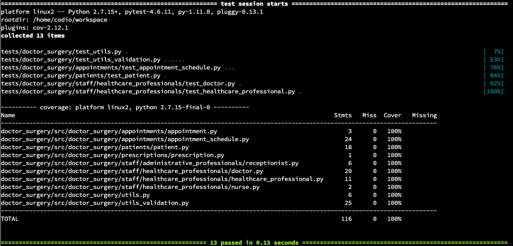

# README #

### Purpose of this repository ###

This repository stores codes written in Python 2.7.15 to manage a doctor surgery, providing the ability for patients to book/cancel an appointment or order a prescription, and for doctors to check their schedule or issue a prescription.

### Environment ###

These codes were developed via the industry-grade PyCharm IDE (2021.2.4), which offers more capabilities than Codio to write productionised software in Python; nevertheless, the Codio environment was replicated and used in PyCharm. Full instructions to install the required dependencies and run the software are provided below.

### To set up ###

* Install dependencies

Please install the required dependencies by running:

- either `sudo pip install -r requirements.txt` if on Codio (Linux VM)
- or `pip install -r requirements.txt` otherwise.

### To run the software ###

To use the codes, please run the `app.py` file at `doctor_surgery/src/doctor_surgery` via
`python app.py` on a Python console. Thereafter, follow the prompts on the console, type the relevant option and press 'Enter' to execute each step.

### Design implementation ###

The main `doctor_surgery` directory follows a package structure, with an `__init__.py` file for every folder. Moreover, it facilitates testing, as the `tests` folder follows its structure.

The `app.py` file has the following wrapper functions that enables a user to consume the 'doctor surgery' application:

- `landing_options`, which enables to run the entire application, allowing a user to register a new patient, to log in as an existing patient or doctor;

- `patient_selections` that allows patients to check and order prescriptions, and to schedule or cancel appointments;

- `doctor_selections`, which enables doctors to view their schedule or issue prescriptions.

The business logic was implemented by adhering to Object-Oriented Programming (OOP)-related principles, thus being modular and decoupled into files that contain classes and their methods, under the `doctor_surgery/src/doctor_surgery` directory. Furthermore, `constants.py` and `utils.py` files were created to host fixed values and helper/utility-type of functions respectively, to enable re-usability and facilitate maintainability.

The instantiation of the objects adheres to the OOP-oriented design that the tutor provided, specified at the file `system_design/uml_diagram.png`. Salient elements of the application, i.e., the patients, doctors, prescriptions, and appointments, were built and leveraged as lists of dictionaries, as they are data structures that enable an efficient search and update of their values or objects based on a relevant key.

### Testing approach ###

Functional testing was carried out during and after development to ensure the correct functionality of the application, as per the evidence at `test_evidence/functional_testing_on_console`.

Positive and negative test cases were created when relevant and unit testing was performed to notice and fix bugs proactively, and to improve the robustness of the software design.

### To run the tests ###

All tests can be executed by running `pytest tests`. To visualise the full coverage report, run `pytest --cov=doctor_surgery tests --cov-report term-missing`. 

Full (100%) test coverage was achieved as illustrated below.

#### Report with full test coverage ####

### Limitations and future work ###

Having to code in Python 2.7.15 as per the Codio environment was a limiting factor, since Python 3.X has more functionalities, including f-strings and type hints on the function's definition, which would have accelerated development.

Using Python 2.7.15, the Python library `sqlite3` could not be installed; thus, the main limitation of the proposed implementation lies in not persisting the data that are entered by the user after the application is closed, although data persistence was not a requirement of this OOP-related Python-focused assignment.

Moreover, as a future work, a GUI could be developed, e.g., via the Python library `tkinter`, for a better user experience. 

### References ###

Lian, V., Varoy, E., & Giacaman, N. (2022). Learning Object-Oriented Programming Concepts Through Visual Analogies. IEEE Transactions on Learning Technologies.

Lutz, M. (2010). Programming python: powerful object-oriented programming. " O'Reilly Media, Inc.".

Phillips, D. (2015). Python 3 object-oriented programming. Packt Publishing Ltd.
